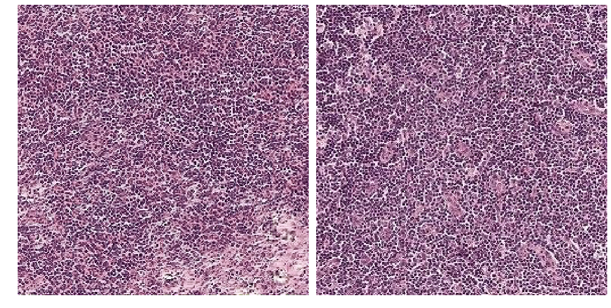

# Generative Adversarial Networks for Digital Pathology
### Description ###
Detection of metastases in hematoxylin and eosin stained whole-slide images of lymph node sections requires large amounts of reading and annotating time from pathologists. The result is a lack of labelled data and considerable challenges when attempting to train an accurate algorithm.

This project demonstrates how to use WGAN to generate synthetic but realistic images that can then be used to train other algorithms.

The model is trained on [CAMELYON16](https://camelyon16.grand-challenge.org) dataset. The dataset contains of whole slide images (WSIs) of sentinel lymph node including normal slides and slides containing metastases. 

WSIs are generally stored in a multi-resolution pyramid structure. Image files contain multiple downsampled versions of the original image. Each image in the pyramid is stored as a series of tiles.

Due to the large size of the original images, the model was trained on the tiles from the third level of normal WSIs. The tiles are 256x256 RGB images, which can be found [here](https://drive.google.com/open?id=1VNLvZ1c5WPN-2bbdBvluwO4dtyP8HKMR).

The model has been trained on these tiles and is able to generate realsitic images.

### Results ###
On the left - fake images, on the right - real images

### Loss function ###
